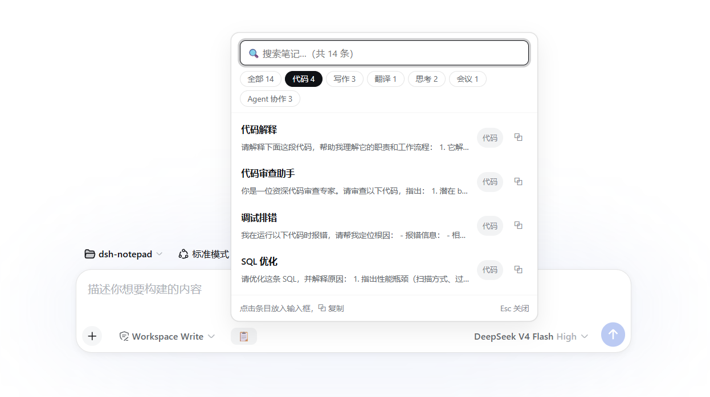
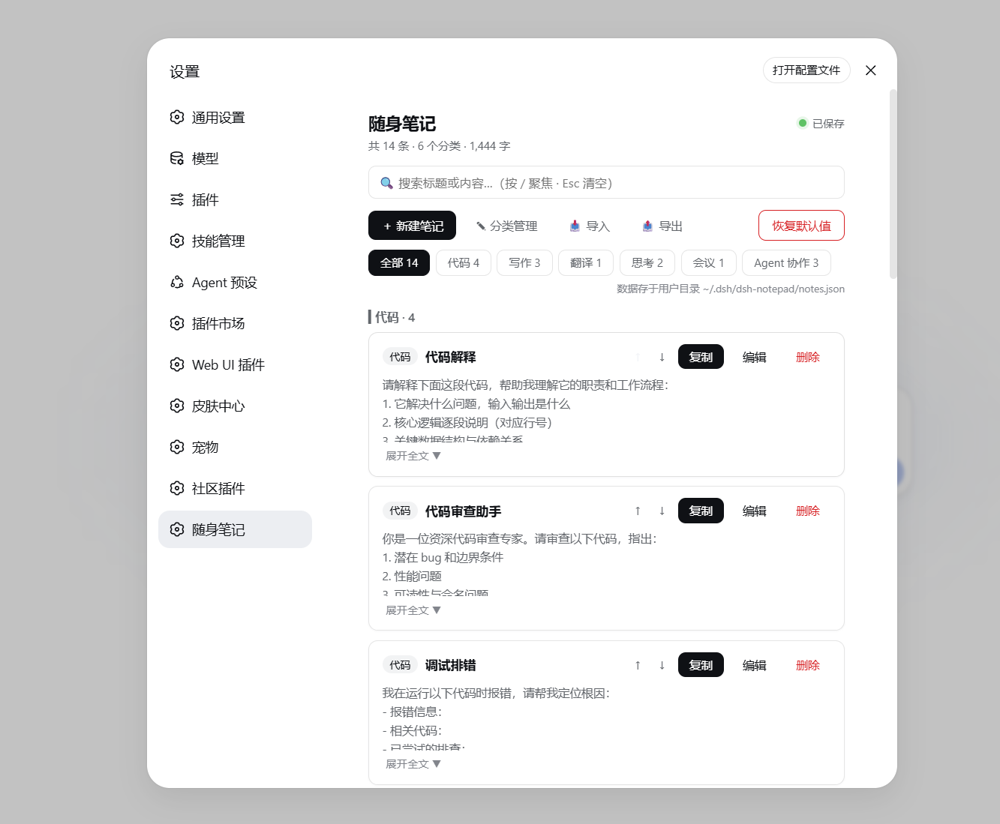

# dsh-notepad · 随身笔记

为 DeepSeek Harness Web GUI（`dsh web`）打造的**常用片段库**：提示词、模板、话术、代码片段、备忘……把高频常用的东西集中记在一个地方，**在输入框旁一键取用**。

## 这个插件解决什么

写周报、润色邮件、代码审查、翻译、会议纪要……每次都要重新组织 prompt 很麻烦；常用的文本片段散落在备忘录、聊天记录里，用的时候找不到。把高频内容提前存好：**聊天时点一下输入框旁的图标，弹出随身笔记，搜索分类、点击即放入输入框**。





## 主要功能

- **输入框快捷入口** — 聊天输入框旁一个 📋 图标按钮，点击弹出笔记面板：按分类筛选、搜索、点击即放入输入框（保留已有草稿），⧉ 一键复制
- **分类管理** — 按使用场景分门别类（代码 / 写作 / 翻译 / 思考 / 会议…），支持新增、重命名、删除与排序
- **集中管理** — 设置面板「随身笔记」页统一管理所有笔记：增删改、排序、搜索（`/` 聚焦、`Esc` 清空）
- **一键复制** — 点击卡片标题或内容即复制进剪贴板
- **导入别人的笔记** — 📥 导入：直接选择别人分享的笔记文件，支持两种格式：
  - **dsh-notepad JSON**（插件导出格式，`{"version":1,"notes":[…]}`，或纯数组），也可导入其他工具的同类导出
  - **任意文本 / Markdown 笔记文件**（自动作为一条笔记，文件名成为标题）
  - 导入前有预览弹窗，可选择**合并（推荐，自动跳过重复）**或**覆盖全部**
- **导出分享** — 📤 导出：一键把全部笔记下载为 JSON 文件，方便备份、迁移或发给别人直接导入
- **数据归属你** — 笔记保存在本地用户目录的 JSON 文件（`~/.dsh/dsh-notepad/notes.json`），结构清晰、随时备份；卸载插件不丢数据
- **恢复默认值** — 一键还原为插件内置默认笔记（原数据自动备份为 `notes.json.backup-*`）

## 安装

```sh
dsh plugin --profile web add github:chenchen4396/dsh-notepad
```

- **锁定版本**（推荐，保证可复现）：追加 `#<commit-sha>`
- **本地开发 / 离线环境**：clone 后用 `dsh plugin --profile web add link:/path/to/dsh-notepad`
- **网络受限的环境**：可用 SSH URL `git+ssh://git@github.com/chenchen4396/dsh-notepad.git`

安装完成后**重启 `dsh web`**：输入框旁出现 📋 图标按钮；设置面板出现「随身笔记」页。

卸载：`dsh plugin --profile web remove dsh-notepad`（笔记数据保留在磁盘，重装不丢）。

## 数据文件

笔记存于用户目录下的 `notes.json`（默认 `~/.dsh/dsh-notepad/notes.json`）：

```json
{
  "version": 1,
  "notes": [
    { "id": "63609328", "category": "代码", "title": "代码解释", "content": "…", "updatedAt": 1712345678901 }
  ]
}
```

`version` 字段为将来格式升级预留，读取时未知字段会被忽略；也可以手动编辑 JSON，刷新页面后生效。数据就是这一个 JSON 文件——首次启动时会自动写入内置默认笔记，编辑后刷新页面即生效。